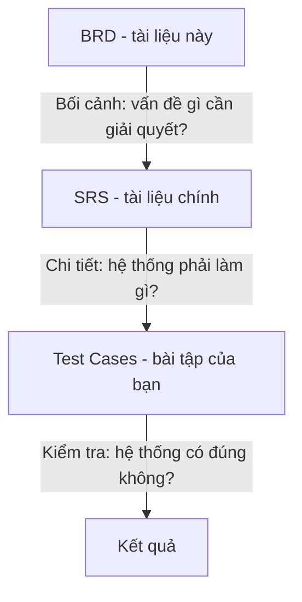
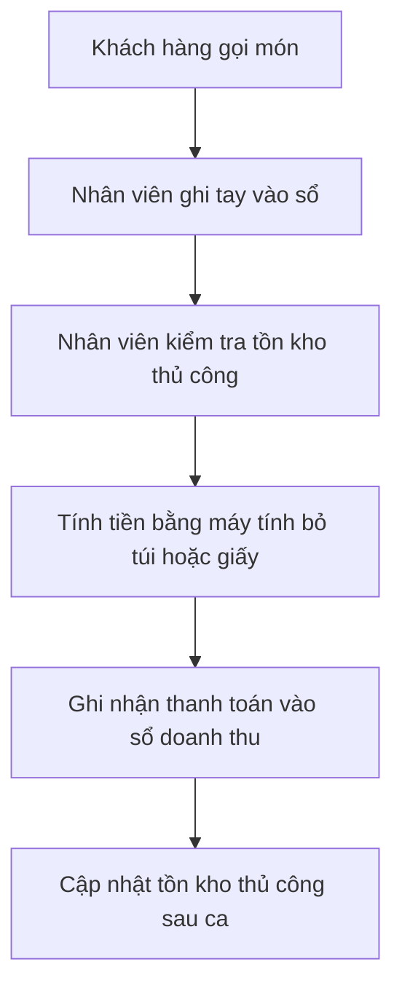
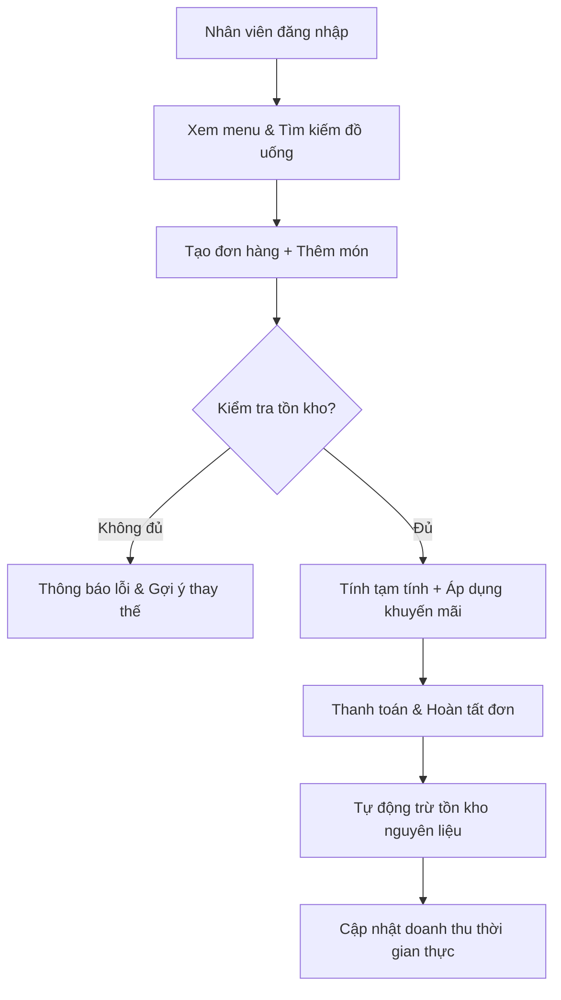

# BRD — Tài liệu Yêu cầu Nghiệp vụ
## (Business Requirements Document)

> **📚 Hệ thống hư cấu / Fictional System**: Quán Cà Phê ABC là hệ thống **hư cấu** được thiết kế cho mục đích học tập. Tên nhân vật, tổ chức và dữ liệu đều là giả lập.  
> *ABC Coffee is a **fictional** system designed for educational purposes. All names, organizations, and data are simulated.*

> **📌 Lưu ý cho sinh viên**: Đây là tài liệu **tham khảo** (reference). Bạn **không** viết test case dựa trên BRD.  
> BRD giúp bạn hiểu **tại sao** hệ thống được xây dựng và yêu cầu **đến từ ai**. Tài liệu chính để kiểm thử là **SRS**.



> **⚠️ Lưu ý quan trọng**: BRD là phiên bản yêu cầu **ban đầu** từ khách hàng. Trong quá trình phân tích, BA có thể điều chỉnh một số chi tiết khi viết SRS. Đây là điều bình thường trong dự án thực tế — SRS luôn là phiên bản **chính xác hơn** để kiểm thử.

| Thông tin tài liệu | |
|---|---|
| **Dự án** | Hệ thống Quản lý Quán Cà Phê ABC |
| **Phiên bản** | 1.0 |
| **Ngày tạo** | 16/04/2026 |
| **Người yêu cầu** | Bà Lê Thị Cà Phê — Chủ quán Cà Phê ABC |
| **Người tiếp nhận** | Ông Nguyễn Văn Quản — Trưởng dự án / Project Manager, Công ty phần mềm XYZ |

---

## 1. Bối cảnh

Quán Cà Phê ABC là một quán cà phê nhỏ phục vụ sinh viên và nhân viên văn phòng gần trường đại học. Hiện tại quán đang quản lý mọi hoạt động bằng **sổ tay và tính toán thủ công**. Quy trình hiện tại gặp nhiều vấn đề nghiêm trọng:

- Nhân viên mất nhiều thời gian tìm kiếm đồ uống và kiểm tra nguyên liệu tồn kho.
- Thường xuyên nhầm lẫn tình trạng đồ uống (còn hay hết tạm thời do hết nguyên liệu).
- Không kiểm soát tốt tồn kho nguyên liệu, dẫn đến tình trạng hết nguyên liệu giữa ca hoặc lãng phí.
- Khó theo dõi doanh thu theo ca/ngày và xác định món bán chạy.
- Không có cơ chế áp dụng khuyến mãi nhanh chóng và chính xác.
- Khách hàng phải chờ lâu khi nhân viên tính tiền thủ công.

Chủ quán mong muốn có một **ứng dụng web đơn giản** để tin học hóa quy trình bán hàng, quản lý đơn hàng và tồn kho.

---

## 2. Mục tiêu nghiệp vụ

| Mã | Mục tiêu | Độ ưu tiên |
|----|---------|-----------|
| BO-01 | Số hóa quy trình tạo đơn hàng và thanh toán, thay thế sổ tay | Cao |
| BO-02 | Quản lý tồn kho nguyên liệu thời gian thực, cảnh báo hết hàng | Cao |
| BO-03 | Tự động tính toán doanh thu và thống kê món bán chạy | Cao |
| BO-04 | Hỗ trợ tìm kiếm & lọc menu đồ uống nhanh chóng | Cao |
| BO-05 | Quản lý nhân viên và phân quyền rõ ràng | Trung bình |
| BO-06 | Áp dụng khuyến mãi/voucher linh hoạt | Trung bình |
| BO-07 | Giao diện đơn giản, dễ sử dụng cho nhân viên phục vụ | Cao |

---

## 3. Phạm vi dự án

### 3.1. Trong phạm vi (In-scope)

- Đăng nhập phân quyền theo vai trò (Quản lý & Nhân viên)
- Quản lý menu đồ uống (xem, tìm kiếm, lọc)
- Tạo đơn hàng và thêm nhiều món vào đơn
- Thanh toán đơn hàng với nhiều hình thức
- Quản lý tồn kho nguyên liệu (cập nhật tự động khi bán hàng)
- Quản lý nhân viên (thêm, sửa, thay đổi trạng thái)
- Báo cáo doanh thu cơ bản theo ngày/tuần
- Hỗ trợ song ngữ Việt–Anh

### 3.2. Ngoài phạm vi (Out-of-scope)

- Thanh toán online qua cổng thanh toán bên thứ ba
- Chương trình khách hàng thân thiết / tích điểm
- Quản lý bàn ghế và đặt chỗ trước
- In hóa đơn vật lý (chỉ hiển thị trên màn hình)
- Báo cáo thống kê nâng cao (dự báo doanh thu, phân tích xu hướng)
- Ứng dụng di động

---

## 4. Quy trình nghiệp vụ hiện tại (As-Is)



**Vấn đề chính:**
- Dễ sai sót khi tính tiền và tồn kho
- Không biết chính xác món nào bán chạy
- Mất thời gian kiểm tra nguyên liệu
- Khó kiểm soát nhân viên và doanh thu theo ca

---

## 5. Quy trình nghiệp vụ mong muốn (To-Be)



---

## 6. Quy tắc nghiệp vụ

| Mã | Quy tắc | Chi tiết |
|----|---------|---------|
| BR-01 | Giới hạn đơn hàng | Tối đa **10 món** trong một đơn hàng |
| BR-02 | Kiểm tra tồn kho | Chỉ cho phép thêm món khi nguyên liệu chính đủ |
| BR-03 | Cảnh báo tồn kho | Cảnh báo khi nguyên liệu còn dưới **10 đơn vị** |
| BR-04 | Khuyến mãi | Hỗ trợ giảm giá % hoặc giảm cố định (áp dụng cho toàn đơn) |
| BR-05 | Hình thức thanh toán | Tiền mặt, Chuyển khoản, Ví điện tử |
| BR-06 | Báo cáo doanh thu | Tính theo ngày, tuần, tháng và top món bán chạy |
| BR-07 | Phân quyền | Nhân viên chỉ tạo và thanh toán đơn. Quản lý được quản lý kho, nhân viên & xem báo cáo |
| BR-08 | Tìm kiếm | Không phân biệt chữ hoa/thường (case-insensitive) |
| BR-09 | Xác thực email | Email phải hợp lệ (có `@` và dấu `.` trong phần domain) |

---

## 7. Các bên liên quan (Stakeholders)

| Vai trò | Người đại diện | Mối quan tâm chính |
|---------|----------------|-------------------|
| Chủ quán (Customer) | Bà Lê Thị Cà Phê | Hệ thống giúp tăng tốc độ phục vụ, giảm sai sót, kiểm soát tốt tồn kho và doanh thu |
| Quản lý quán | Ông Trần Văn Quản | Quản lý nhân viên, tồn kho và báo cáo dễ dàng |
| Nhân viên phục vụ (End User) | 4–6 nhân viên | Giao diện dễ dùng, tạo đơn và thanh toán nhanh |
| Khách hàng | Sinh viên & nhân viên văn phòng | Phục vụ nhanh, đồ uống đúng, ít chờ đợi |

---

## 8. Ràng buộc và giả định

### Ràng buộc:
- Ngân sách hạn chế → ưu tiên ứng dụng web, dữ liệu lưu trong bộ nhớ trình duyệt (client-side only).
- Không có server backend → dữ liệu sẽ reset khi refresh trang.
- Thời gian phát triển: **4 tuần**.

### Giả định:
- Quán có khoảng 30–50 món đồ uống.
- Có một số nguyên liệu chính cần quản lý (cà phê bột, sữa tươi, siro, ly giấy, topping…).
- Hệ thống được sử dụng chủ yếu trên máy tính để bàn và máy tính bảng (trình duyệt Chrome).
- Mỗi món đồ uống có **1 công thức nguyên liệu** cố định.

---

## 9. Tiêu chí nghiệm thu (Acceptance Criteria)

| Mã | Tiêu chí | Phương pháp kiểm tra |
|----|---------|---------------------|
| AC-01 | Đăng nhập thành công theo vai trò | Nhân viên và Quản lý truy cập được vào chức năng phù hợp |
| AC-02 | Tạo đơn hàng và thêm món thành công | Đơn hàng hiển thị đúng món và tạm tính chính xác |
| AC-03 | Từ chối thêm món khi hết nguyên liệu | Hiển thị thông báo lỗi rõ ràng |
| AC-04 | Thanh toán hoàn tất và tự động trừ tồn kho | Tồn kho được cập nhật chính xác sau khi thanh toán |
| AC-05 | Áp dụng khuyến mãi đúng | Tổng tiền sau khi giảm giá chính xác |
| AC-06 | Xem báo cáo doanh thu | Hiển thị đúng doanh thu theo ngày/tuần và top món bán chạy |
| AC-07 | Quản lý thêm nhân viên mới | Nhân viên mới xuất hiện trong danh sách và có thể đăng nhập |
| AC-08 | Giao diện hỗ trợ Tiếng Việt và Tiếng Anh | Chuyển ngôn ngữ hoạt động đúng |

---

## 10. Lịch trình mong muốn

| Giai đoạn | Thời gian | Sản phẩm |
|-----------|----------|---------|
| Phân tích yêu cầu | Tuần 1 | SRS hoàn chỉnh |
| Thiết kế & Phát triển | Tuần 2–3 | Ứng dụng web hoàn chỉnh |
| Kiểm thử | Tuần 4 | Báo cáo kiểm thử, sửa lỗi |
| Bàn giao | Cuối tuần 4 | Hệ thống sẵn sàng sử dụng |

---

*Ký duyệt:*

| | Họ tên | Chức vụ | Ngày |
|---|--------|--------|------|
| **Người yêu cầu** | Lê Thị Cà Phê | Chủ quán Cà Phê ABC | 16/04/2026 |
| **Người tiếp nhận** | Nguyễn Văn Quản | Trưởng dự án / PM, Công ty XYZ | 16/04/2026 |

```

**Hướng dẫn sử dụng:**  
Copy toàn bộ nội dung trên → Paste vào một file mới → Lưu với tên:  
`BRD-yeu-cau-nghiep-vu-coffee.md`

Bạn muốn mình tiếp tục viết **SRS đầy đủ** cho Hệ thống Quản lý Quán Cà Phê ABC luôn không? Mình có thể viết ngay với cấu trúc tương tự SRS Thư viện.
