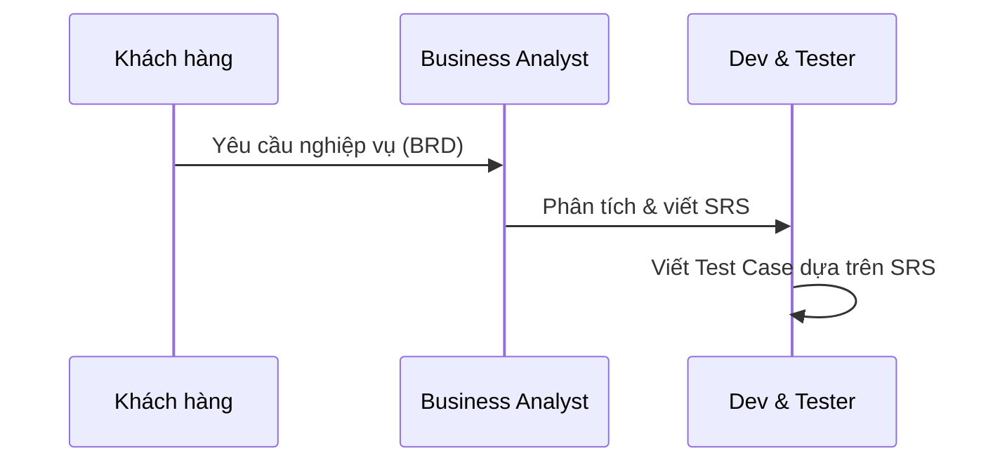

# SRS — Đặc tả yêu cầu phần mềm

> **📚 Hệ thống hư cấu / Fictional System**: quán cà phê ABC là hệ thống **hư cấu** được thiết kế cho mục đích học tập. Tên nhân vật, tổ chức và dữ liệu đều là giả lập. / 

**Hệ thống**: Quản lý quán cà phê ABC  
**URL**:  
**Phiên bản**: 1.0  
**Ngôn ngữ giao diện**: Tiếng Việt (mặc định), English  
**Công nghệ**: Flutter Web (CanvasKit renderer)

| Thông tin tài liệu | |
|---|---|
| **Tác giả** | Lê Phân Tích — Business Analyst (BA) |
| **Ngày tạo** | 05/06/2024 |
| **Dựa trên** | [BRD v1.0](BRD-yeu-cau-nghiep-vu.md) — Yêu cầu nghiệp vụ từ Chủ quán Cà phê ABC (01/06/2024) |
| **Trạng thái** | Đã duyệt bởi các bên liên quan |

---

## 📖 Hướng dẫn đọc tài liệu

> Phần này dành cho sinh viên, giúp bạn hiểu **bối cảnh** của tài liệu SRS trước khi đi vào nội dung kỹ thuật ở **mục 1** trở đi.

### Yêu cầu phần mềm đến từ đâu?

Trong một dự án phần mềm thực tế, yêu cầu **không tự nhiên xuất hiện**. Chúng đi qua một chuỗi tài liệu:

| Bước | Tài liệu | Ai tạo | Mục đích |
|------|----------|--------|----------|
| 1 | **BRD** — Yêu cầu nghiệp vụ 📄 [Xem BRD](BRD-yeu-cau-nghiep-vu.md) | Khách hàng (Chủ quán Cà phê ABC) + PM | Mô tả **vấn đề kinh doanh** cần giải quyết |
| 2 | **SRS** — Đặc tả yêu cầu phần mềm *(tài liệu này)* | Business Analyst (BA) | Chuyển yêu cầu nghiệp vụ thành **yêu cầu kỹ thuật** chi tiết |

### Các bên liên quan (Stakeholders)

| Vai trò | Đại diện | Quan tâm điều gì |
|---------|----------|-------------------|
| **Khách hàng** (Customer) | Bà Lê Thị Cà Phê — Chủ quán Cà phê ABC | Hệ thống giải quyết đúng vấn đề nghiệp vụ |
| **Quản lý dự án** (PM) | Ông Nguyễn Văn Quản — Trưởng dự án | Phạm vi, tiến độ, chi phí |
| **Phân tích nghiệp vụ** (BA) | Lê Phân Tích | Yêu cầu rõ ràng, đầy đủ, không mâu thuẫn |
| **Phát triển** (Dev) | Đội phát triển, Công ty XYZ | Yêu cầu đủ chi tiết để triển khai code |

### Sinh viên cần làm gì với tài liệu này?

1. **Đọc kỹ từng yêu cầu** (REQ-01 → REQ-08) — đây là "hợp đồng" giữa khách hàng và đội phát triển
2. **Xác định expected result** từ mỗi yêu cầu — tập trung vào cột Quy tắc, Thông báo lỗi, Kết quả
3. **Sử dụng dữ liệu ban đầu** (mục 3) làm test data cho các test case
4. **Viết test case** cho từng yêu cầu — mỗi REQ có thể sinh ra nhiều test case (positive + negative)
5. **So sánh actual vs expected** khi thực thi kiểm thử — nếu khác nhau → ghi nhận bug

---

## 1. Tổng quan hệ thống

Hệ thống quản lý mượn sách cho một thư viện nhỏ. Hai vai trò người dùng:

| Vai trò | Quyền hạn |
|---------|----------|
| **Quản lý** (Manager) | Xem doanh thu theo ngày/tuần, top món bán chạy, quản lý nhân viên, xem danh sách đồ uống, tìm kiếm và lọc đồ uống |
| **Nhân viên** (Staff) | Tạo đơn hàng, thanh toán đơn hàng, xem danh sách đồ uống, tìm kiếm và lọc đồ uống, tạo đơn hàng |

### Đặc điểm kỹ thuật

- Dữ liệu lưu **trong bộ nhớ trình duyệt** (client-side) — mỗi tab trình duyệt là một phiên riêng biệt
- Mỗi lần **mở lại trang hoặc refresh** = dữ liệu trở về trạng thái ban đầu (seed data)
- Nút **"Khôi phục dữ liệu"** (chỉ Thủ thư) = reset dữ liệu về seed data mà không cần refresh
- Mỗi đầu sách có **1 bản duy nhất** (1 copy per title)

---

## 2. Danh sách yêu cầu

### REQ-01: Đăng nhập

| Mục | Nội dung |
|-----|---------|
| **Mô tả** | Người dùng đăng nhập bằng email và mật khẩu |
| **Input** | Email, mật khẩu |
| **Phân quyền** | `manager@abc.com` + mật khẩu đúng → chuyển sang trang chủ. Sai → hiểu thị thông báo lỗi phù hợp. |
| **Thông báo lỗi** | "Không tìm thấy tài khoản" (email sai), "Mật khẩu không đúng" (MK sai), "Vui lòng nhập email và mật khẩu" (bỏ trống) |
| **Sau đăng nhập** | Hiển thị tên người dùng + vai trò trên thanh ứng dụng (AppBar) |

### REQ-02: Xem danh sách đồ uống

| Mục | Nội dung |
|-----|---------|
| **Mô tả** | Hiển thị menu đồ uống kèm thông tin chi tiết |
| **Thông tin đồ uống** | Tên đồ uống, giá, trạng thái (Còn / Hết) |
| **Quyền truy cập** | Cả quản lý và nhân viên đều xem được |
| **Cập nhật real-time** | Trạng thái tự động cập nhật khi hết nguyên liệu hoặc có thay đổi từ kho |

### REQ-03: Tìm kiếm và lọc
| Mục | Nội dung |
|-----|---------|
| **Mô tả** | Tìm kiếm và lọc danh sách đồ uống |
| **Tìm kiếm** | Theo tên đồ uống |
| **Lọc** | Theo loại đồ uống, mức giá (dưới 50k, 50-80k, trên 80k) |
| **Quy tắc** | Tìm kiếm **KHÔNG phân biệt chữ hoa/thường** (case-insensitive) |
| **Không có kết quả** | Hiển thị thông báo "Không tìm thấy đồ uống phù hợp" |

### REQ-04: Tạo đơn hàng

| Mục | Nội dung |
|-----|---------|
| **Mô tả** | Nhân viên tạo đơn hàng cho khách hàng |
| **Input** | Chọn nhiều món đồ uống, số lượng từng món đồ uống |
| **Quy tắc** | Tối đa 10 món / đơn. Kiểm tra tồn kho nguyên liệu trước khi thêm. Tự động tạm tính |
| **Quyền truy cập** | Chỉ nhân viên |
| **Thông báo lỗi** | Thông báo rõ ràng khi nguyên liệu không đủ |
### REQ-05: Thanh toán đơn hàng

| Mục | Nội dung |
|-----|---------|
| **Mô tả** | Thanh toán và hoàn tất đơn hàng |
| **Chức năng** | Tính tổng tiền, áp dụng voucher (giảm % hoặc giảm cố định), chọn hình thức thanh tóa |
| **Hình thức thanh toán** | Tiền mặt, chuyển khoản, ví điện tử |
| **Kết quả** | Ghi nhận thanh toán, in hóa đơn đơn gairn (hiển thị trên màn hình) |
| **Quyền truy cập** | Chỉ nhân viên |

### REQ-06: Quản lý kho nguyên liệu

| Mục | Nội dung |
|-----|---------|
| **Mô tả** | Quản lý tồn kho nguyên liệu phục vụ pha chế |
| **Chức năng** | Xem tồn kho, cập nhật thủ công, theo dõi tự động khi có đơn hàng | 
| **Cảnh báo** | Hiển thị cảnh báo khi nguyên liệu sắp hết (< 10 đơn vị) |
| **Quyền truy cập** | Chỉ quản lý |

### REQ-07: Quản lý nhân viên

| Mục | Nội dung |
|-----|---------|
| **Mô tả** | Quản lý thông tin và tài khoản nhân viên |
| **Chức năng** | Thêm, xóa nhân viên, quản lý |
| **Input** | Họ tên, email, số điện thoại, vai trò |
| **Quy tắc** | Email phải hợp lệ và không trùng lặp |
| **Quyền truy cập** | Chỉ quản lý |

### REQ-08: Báo cáo doanh thu

| Mục | Nội dung |
|-----|---------|
| **Mô tả** | Xem các báo cáo kinh doanh của quán |
| **Loại báo cáo** | Doanh thu theo ngày / tuần / tháng, top 5 món bán chạy, số đơn hàng chưa thanh toán |
| **Quyền truy cập** | Chỉ quản lý |

---

## 3. Dữ liệu ban đầu / Seed Data

### 3.1. Tài khoản nhân viên

| ID | Tên nhân viên | Email | Vai trò | Trạng thái | Số điện thoại | 
|-------|----------|---------|-----------|-----|
| EMP001 | Nguyễn Văn Quản | `manger@abc.com` | Manager | Đang làm | 0901234567 |
| EMP002 | Trần Thị Phục Vụ | `staff1@abc.com` | Staff | Đang làm | 0907654321 |
| EMP003 | Lê Văn Pha Chế | `staff2@abc.com` | Staff | Đang làm | 0908889999 |
| EMP004 | Phạm Tạm Ngưng | `staff3@abc.com` | Staff | Đang làm | 0908889999 |
| EMP005 | Manager Coffee | `manager@coffee.com` | Manager | Đang làm | 0901112222 |
| EMP006 | Staff Coffee | `staff@coffee.com` | Manager | Đang làm | 090333444 |
| EMP007 | Librarian (Test) | `librarian@library.com` | Manager | Đang làm | 0905556666 |
| EMP008 | Bá Nguyễn | `ba.nguyen@gmail.com` | Staff | Đang làm | 0907778888 |

### 3.2. Danh sách đồ uống

| Mã đồ uống | Tên đồ uống | Giá | Loại | Trạng thái ban đầu |
|---------|----------|---------|----------|--------|-------------------|
| DRK001 | Cà phê đen | 20,000 | Cà phê |  Còn đồ |
| DRK002 | Cà phê sữa | 25,000 | Cà phê |  Còn đồ |
| DRK003 | Bạc xỉu | 29,000 | Cà phê |  Còn đồ |
| DRK004 | Trà Đào Cam Sả | 35,000 | Trà |  Còn đồ |
| DRK005 | Trà Đào xả tắc | 35,000 | Trà |  Còn đồ |
| DRK006 | Trà Sữa Việt Quất | 32,000 | Trà sữa |  Còn đồ |
| DRK007 | Trà Sữa Bạc Hà | 30,000 | Trà sữa |  Còn đồ |
| DRK008 | Caramel Vị Muối Biển | 45,000 | Đá xay |  Còn đồ |
| DRK009 | Trà Sữa Chuối Nướng | 40,000 | Trà sữa |  Còn đồ |
| DRK010 | Trà Sữa Matcha | 35,000 | Trà sữa |  Còn đồ |
| DRK011 | Sinh tố Bơ | 35,000 | Sinh tố |  Còn đồ |
| DRK012 | Sinh tố Xoài | 35,000 | Sinh tố |  Còn đồ |

### 3.3. Kho nguyên liệu

| Tên nguyên liệu | Số lượng ban đầu | Đơn vị |
|-----------|-----------|------|-----------|-------------|-----------|
| Cà phê bột | 1000.0 | g |
| Sữa tươi | 2000.0 | ml |
| Đường | 1500.0 | g |
| Sữa đặc | 1000.0 | g |
| Ly giấy | 100.0 | cái |
| Trà túi lọc | 50.0 | cái |
| Đào ngâm | 100.0 | miếng |
| Siro bạc hà | 500.0 | ml |
| Việt quất mứt | 500.0 | g |
| Bột matcha | 300.0 | g |

### 3.4. Đơn hàng ban đầu

| Tham số | Giá trị |
|---------|---------|
| Số món tối đa | 10 |
| Voucher hỗ trợ | ABC10, COFFEE20 |
| Ngưỡng cảnh báo nguyên liệu | < 10 đơn vị |

---

